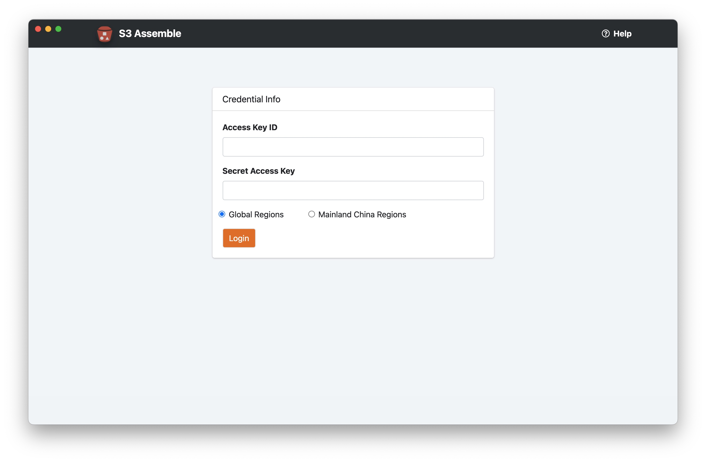
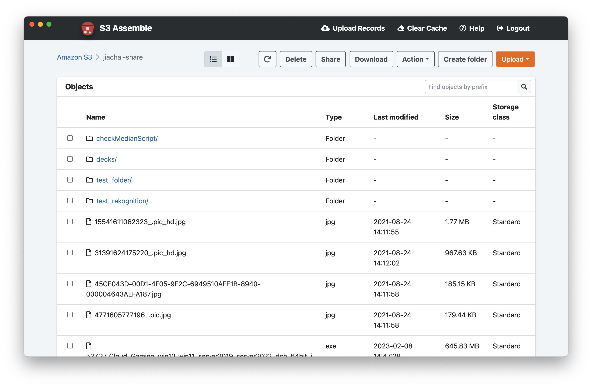
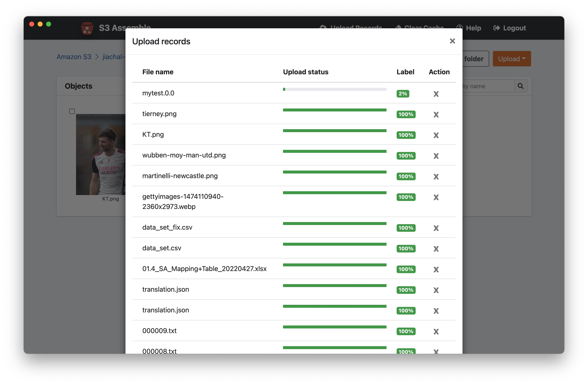

## S3 Assemble

S3 Assemble is an Electron-based GUI client for Amazon S3. It offers a user-friendly alternative to using the AWS console, CLI, and SDK to interact with S3. Currently, it is available for use on both Mac and Windows platforms.

## Features

- Global regions and Mainland China regions support.
- Basic operations, including listing buckets, uploading, downloading, and deleting objects/directories.
- Ability to filter out buckets for which the user has no permission on the storage bucket list page.
- Generate presigned URLs for sharing.
- Preview images.

## Getting Started

#### Install the dependencies

`npm install`

#### Reset when necessary

`rm -rf node_modules && npm install && ./node_modules/.bin/electron-rebuild`

#### Run

`npm run start`

#### Build package

`npm run dist-mac` // output dmg installer

`npm run dist-win` // output exe installer

### Install

When installing S3 Assemble on Mac for the first time, it may prompt that the application is unable to open due to lack of code signing. In this case, authorization for installation can be granted through the "System Preferences" -> "Security & Privacy" -> "General" page.

### Requirement

To login to S3 Assemble, <b>Access Key ID</b> and <b>Secret Access Key</b> are required, which can be obtained through the following steps:

1. Log in to the IAM console using Amazon account ID or account alias, along with your IAM username and password.

2. In the navigation bar in the upper right corner, select your username and then select "My Security Credentials".

3. Expand the "Access keys (access key ID and secret access key)" section.

4. To create an access key, select "Create New Access Key". If this feature is disabled, you must first delete one of the existing keys before creating a new one. It should be noted that you only have one chance to view or download the access key. To copy the key for safekeeping by pasting it to another location, select "Show Access Key". To save the access key ID and secret access key in a .csv file for secure storage on your computer, select "Download Key File".

## License
This library is licensed under the MIT-0 License. See the LICENSE file.

